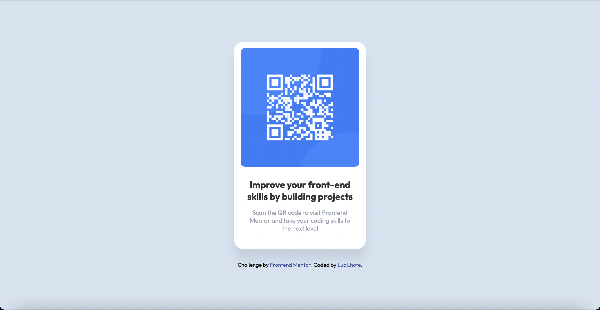
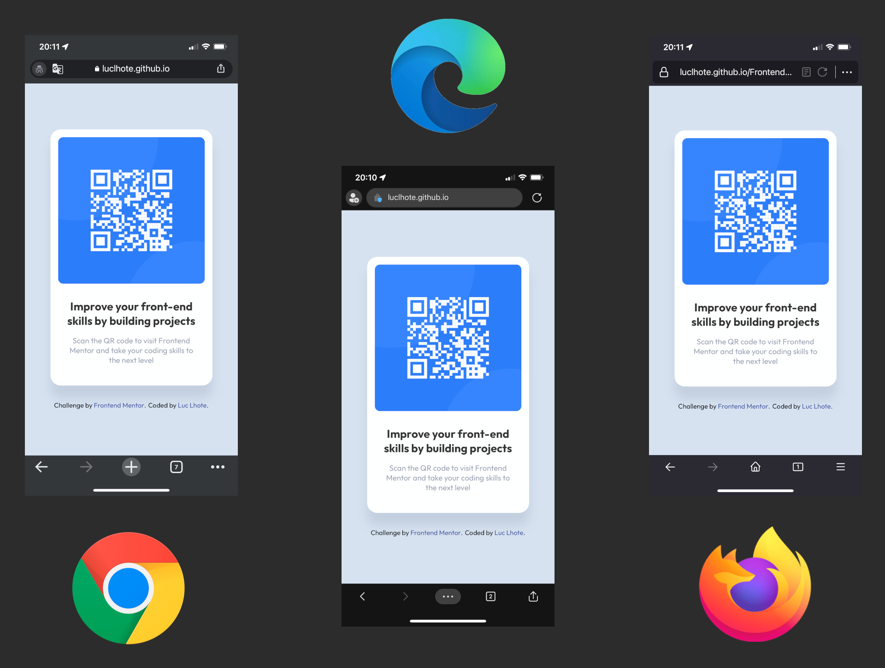
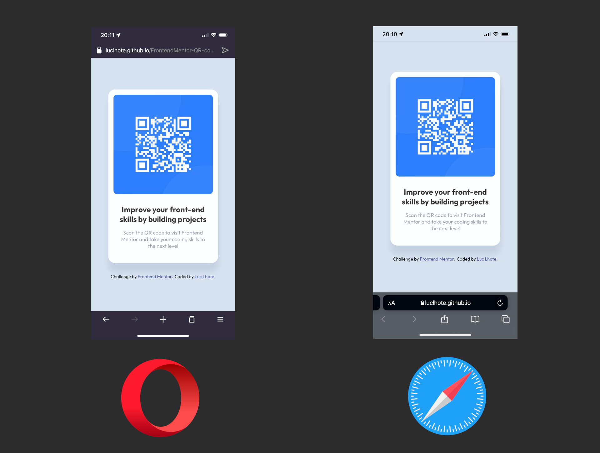

# Frontend Mentor - QR code component solution

This is a solution to the [QR code component challenge on Frontend Mentor](https://www.frontendmentor.io/challenges/qr-code-component-iux_sIO_H). Frontend Mentor challenges help you improve your coding skills by building realistic projects. 

## Table of contents

- [Overview](#overview)
  - [Screenshot](#screenshot)
  - [Links](#links)
- [My process](#my-process)
  - [Built with](#built-with)
  - [Problems to counter and solutions (learning process)](#problems-to-counter-and-solutions-(learning-process))
    - [The QR Code format](#the-qr-code-format)
    - [Height issues on some mobile browsers](#height-issues-on-some-mobile-browsers)
  - [Continued development](#continued-development)
  - [Updates made](#updates-made)
    - [Body size and font size](#body-size-and-font-size)
    - [QR code link](#qr-code-link)
  - [Useful resources](#useful-resources)
- [Author](#author)

## Overview

### Screenshot





### Links

- Solution URL: [https://github.com/LucLhote/FrontendMentor-QR-code-component-challenge](https://github.com/LucLhote/FrontendMentor-QR-code-component-challenge)
- Live Site URL: [https://luclhote.github.io/FrontendMentor-QR-code-component-challenge/](https://luclhote.github.io/FrontendMentor-QR-code-component-challenge/)

## My process

### Built with

- Semantic HTML5 markup
- CSS custom properties
- Flexbox
- ARIA roles

### Problems to counter and solutions (learning process)

#### The QR Code format

The topic of QR code with image format gave me questions on how to interpret the image. Should it be used as decorative content? Should it be used as information that brings something to the reading of the page?

Visually speaking, when you look at the QR code, you know you have to scan it to be redirected to the link it contains. But in itself it does not add anything to the content of the page. If we only look at the QR code, we cannot guess the link or the targeted website, it remains abstract information.

A simple `alt` attribute will describe it as a QR code but does it really matter? If the image does not load, then how will the user access the QR link?

After some thought, I figured it would make more sense to turn that image into a direct link, then add an `alt` attribute with the URL or just some text to indicate where the link leads. The text of the `alt` attribute would become the link text in case the image fails to load.

It represents a good fix and it can improve the expereince of people using a screen reader.

````html
<a href="https://www.frontendmentor.io/">
  
</a>
````

#### Height issues on some mobile browsers

When I submitted my project, I had an exhange with a developper on [Frontend Mentor](https://www.frontendmentor.io/solutions/qr-code-component-challenge-using-flexbox-tCNAQ_AI-). He mentioned an issue apparently brought on mobile devices by the following property and value:

```css
body {
  height: 100vh;
}
```

It wasn't impossible because I didn't test carefully on mobile devices. And I didn't know about this bug before he mentioned it. So I went to check some browsers on iPhone to see the result and I found out that it happens based on the browser, not the device.

By doing some research I understood that it was because of the browser engines which apply different rules, in particular with the WebKit and Blink engines (respectively Safari and Chrome). Blink is actually a fork of WebKit.

I tested three ideas. The first was advised by the developer who mentioned this key point. He told me that I should use the following property and value instead:

```css
body {
  min-height: 100vh;
}
```

I didn't really understand why this would solve the problem.

I tested and this idea was not a fix. The only thing I agreed with was that I should use the `min-height` property, because my QR section has a fixed size and I didn't account for people with a very small smartphone screen. I locked the `height` at `100vh`, and it wasn't a good solution for a responsive application.

The second idea was to use the `min-width` property with the value `100vh` or `100%` for the body and then add a value for the browsers with WebKit engine.

````css
body {
  min-height: 100vh;
  min-height: -webkit-fill-available;
}
````

In this code, the value `100vh` for the body height would be the fallback value for browsers with a different engine than WebKit. I tested, it worked but not completely. For example, on Opera Android, we still encounter the bug.

I continued my researches and I found the article of someone who explained well what happens and that the best way to counter this is to use JavaScript. 

I continued my research and found someone's article that explained well what is happening and that the best way to counter it is to use JavaScript. (Link to the article: [100vh problem with iOS Safari](https://dev.to/maciejtrzcinski/100vh-problem-with-ios-safari-3ge9))

I tested and this idea works. This is a good solution because it really takes into account the height of each screen.

```js
const appHeight = () => {
    const doc = document.documentElement;
    doc.style.setProperty('--app-height', `${window.innerHeight}px`);
}
window.addEventListener('resize', appHeight);
appHeight();
```

In this code, what happens is simple. We set a new property for the style page: `--app-height`. It represents a variable in CSS, and we apply the height of the user's window to it. Then we use the `window.addEventListener()` method with the `resize` event and the function we just created as arguments. Then we call this function. 

Then, we just need to use the new `--app-height` variable into the CSS. We can do this because of the EventListener.

```css
:root {
    --white-color: hsl(0, 0%, 100%);
    --light-grey-color: hsl(212, 45%, 89%);
    --grayish-blue-color: hsl(220, 15%, 55%);
    --grayish-blue-color-alpha: rgba(123, 135, 157, 0.2);
    --dark-blue: hsl(218, 44%, 22%);
    --app-height: 100%;
}

html, body {
    min-width: 100vw;
    min-height: 100vh;
    min-height: var(--app-height);
    display: flex;
    flex-direction: column;
    justify-content: center;
    align-items: center;
    background-color: var(--light-grey-color);
    font-family: 'Outfit', sans-serif;
}
```

And that's it, the problem of the navigation engines is solved. It was a great experience and I learned a lot from this bug. Special thanks to the developer who mentioned this issue to me.

### Continued development

One of the things I'd like to do is switch between Flexbox and Grid. I don't use Grid often and it's a good project to practice it for a beginner.

### Updates made

#### Body size and font size

At first, when making the project, I decided to use the values ​​provided in the [style.guide](./style-guide.md) file. I decided to challenge myself to apply a fixed size for the body. I managed to make a responsive web page as soon as the body width was less than 1440px. I also thought that's what the challenge asked us to do, but in fact it's more of a guide.

Now that I submitted the challenge, I decided to do as I always do, to make the webpage fully responsive. So I applied relative values.

I did the same for the font size, keeping the pixel values ​​as fallback values ​​in case the `rem` unit doesn't work on some browsers.

#### QR code link

I added a link for the QR code, to counter the issue I raised in the [The QR Code format](#the-qr-code-format) section.

#### 100vh problem with mobile browsers

I added the fix found for it. For more infos check the following section: [The QR Code format](#the-qr-code-format).

#### Box shadow

Looking more closely at the provided design, I noticed a small box shadow. So I added one to the QR section.

### Useful resources

- [Doc GitHub](https://docs.github.com/en/get-started/quickstart) - I followed the various links and understood better how to use GitHub. I also discovered GitHub CLI on MacBook.
- [GitHub Pages](https://pages.github.com/) - It helped me create a live site for this challenge.
- [WAI-ARIA Roles](https://developer.mozilla.org/en-US/docs/Web/Accessibility/ARIA/Roles) - This page explain about ARIA roles. I strongly recommend to take a look at it if you don't know about them.
- [100vh problem with iOS Safari](https://dev.to/maciejtrzcinski/100vh-problem-with-ios-safari-3ge9) - This article explains about the height issues on some browsers.

## Author

- Email - [luc.lhote@outlook.com](luc.lhote@outlook.com)
- Frontend Mentor - [@LucLhote](https://www.frontendmentor.io/profile/LucLhote)
- LinkedIn - [Luc Lhote](https://www.linkedin.com/in/luclhote/)
- freeCodeCamp - [@LucLh](https://www.freecodecamp.org/LucLh)
- freeCodeCamp Forum - [@LucLh](https://forum.freecodecamp.org/u/luclh/summary)
