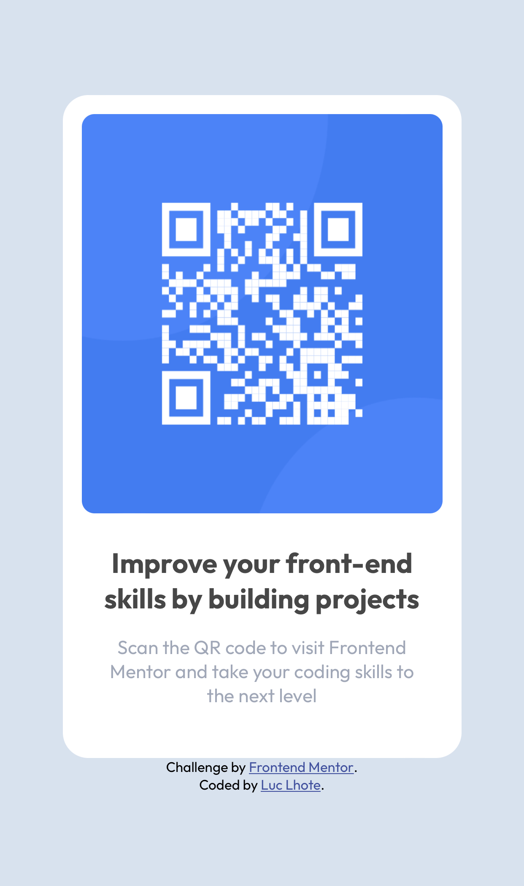

# Frontend Mentor - QR code component solution

This is a solution to the [QR code component challenge on Frontend Mentor](https://www.frontendmentor.io/challenges/qr-code-component-iux_sIO_H). Frontend Mentor challenges help you improve your coding skills by building realistic projects. 

## Table of contents

- [Overview](#overview)
  - [Screenshot](#screenshot)
  - [Links](#links)
- [My process](#my-process)
  - [Built with](#built-with)
  - [What I learned](#what-i-learned)
  - [Continued development](#continued-development)
  - [Useful resources](#useful-resources)
- [Author](#author)

## Overview

### Screenshot

### Links

- Solution URL: [Add solution URL here](https://github.com/LucLhote/FrontendMentor-QR-code-component-challenge)
- Live Site URL: [Add live site URL here](https://luclhote.github.io/FrontendMentor-QR-code-component-challenge/)

## My process

### Built with

- Semantic HTML5 markup
- CSS custom properties
- Flexbox
- ARIA roles

### What I learned

This challenge allowed me to work on a project with existing files and code. I'm the kind of person who likes to work from scratch, which is good and bad. This is my first challenge, and I hope to improve my way of working to be a better teammate in a professional project.

At the HTML/CSS level, I didn't encounter particular difficulties. What was good is that I practiced Flexbox with which I like to work. After submitting my work, I realized that I had accessibility issues. I discovered the ARIA roles that I did not know before.

This challenge also allowed me to discover more about GitHub and GitHub Pages. This is something very important to know when you are a developer. I'm glad I finally tackled this topic.

### Continued development

One of the things I'd like to do is switch between Flexbox and Grid. I don't use Grid often and it's a good project to practice it for a beginner.

### Useful resources

- [Doc GitHub](https://docs.github.com/en/get-started/quickstart) - I followed the various links and understood better how to use GitHub. I also discovered GitHub CLI on MacBook.
- [GitHub Pages](https://pages.github.com/) - It helped me create a live site for this challenge.
- [WAI-ARIA Roles](https://developer.mozilla.org/en-US/docs/Web/Accessibility/ARIA/Roles) - This page explain about ARIA roles. I strongly recommend to take a look at it if you don't know about them.

## Author

- Email - [luc.lhote@outlook.com](luc.lhote@outlook.com)
- Frontend Mentor - [@LucLhote](https://www.frontendmentor.io/profile/LucLhote)
- LinkedIn - [Luc Lhote](https://www.linkedin.com/in/luclhote/)
- freeCodeCamp - [@LucLh](https://www.freecodecamp.org/LucLh)
- freeCodeCamp Forum - [@LucLh](https://forum.freecodecamp.org/u/luclh/summary)
